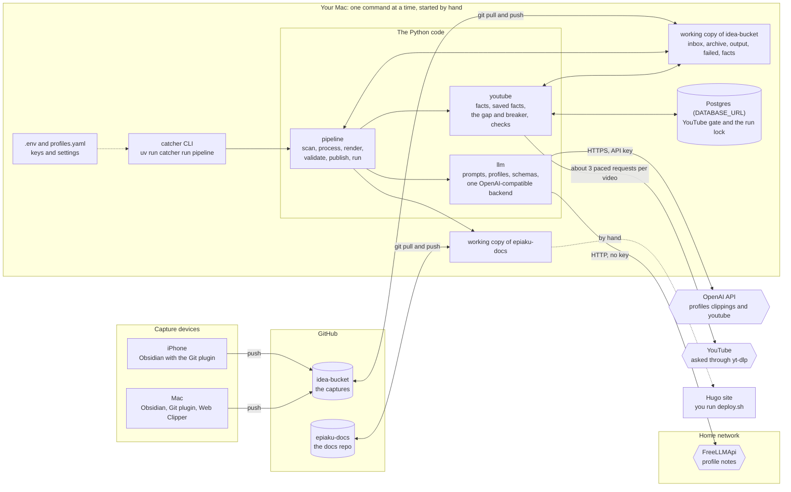
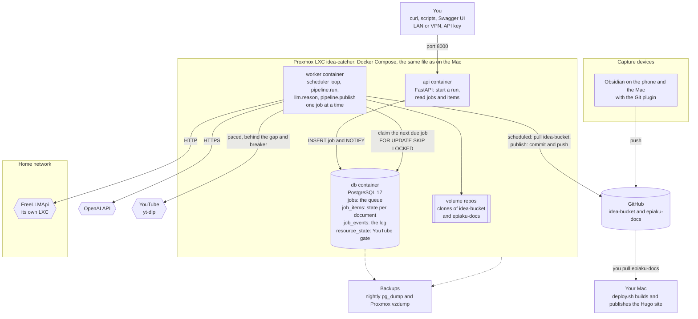
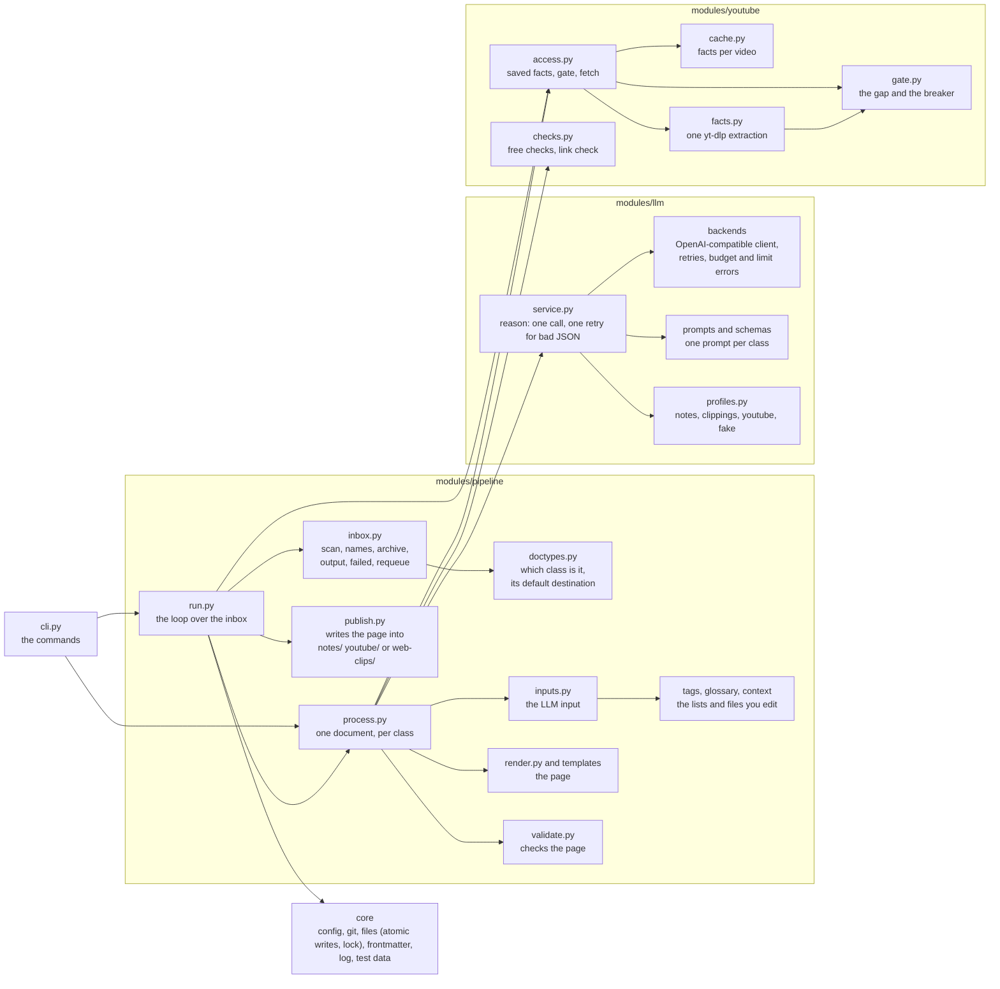

This page shows **what runs where** and **what it talks to**. There are three pictures: the setup that exists today, the planned setup in containers, and the code modules inside the program. The design reasons are on [the service architecture page](../idea-catcher-service-architecture/). The path of one document is on [the document flow page](../idea-catcher-diagram-document-flow/), and what happens inside one document on [the processing loop page](../idea-catcher-diagram-processing-loop/).

## 1. As built today (Stage A): one process on the Mac, no containers

Nothing is installed on a server in Stage A. You start `catcher` yourself, and it runs, commits and stops.

## 2. Planned (Stage B and C): the containers on the Proxmox LXC

Both the `api` and the `worker` container use the same image: Python 3.12 with `uv`, Git, and `yt-dlp` with Deno. There is no Node, no Hugo and no Claude Code CLI in the image, because the docs site is still deployed by hand.

**What is new compared with Stage A:** Postgres holds the state of every document and the queue (so the dashboard can show what is waiting, for how long, and what goes first), a worker runs the schedules (pull, process, publish), and an API starts runs and reads results. The YouTube gate state is in Postgres (since 2026-10-04 also for the CLI: there is no gate file any more).

## 3. The code inside the program

## What runs where

| Part | Where | State it keeps |
| --- | --- | --- |
| `catcher` CLI (Stage A) | Your Mac, started by hand | Nothing between runs, except the files in the two repos; the YouTube gate and the run lock are in Postgres (since 2026-10-04) |
| `worker` (Stage B) | LXC, a container | The queue and the document state, in Postgres |
| `api` (Stage C) | LXC, a container | None. It writes jobs into Postgres and reads results from it |
| `db` | LXC, a container | Jobs, items, events, the YouTube gate. Backed up nightly |
| Clones of the two repos | The Mac now, the `repos` volume later | The captures, the archive, the output, the saved facts, the pages |
| FreeLLMApi | Its own LXC on the home network | A pool of free models (it picks a provider per call) |

## The external services

| Service | Used for | How we call it | When it fails |
| --- | --- | --- | --- |
| **GitHub** | The two repos: captures in, pages out | `git pull`, commit, `git push` (one rebase retry on a rejected push) | A failed pull or push is reported; the files are safe on disk |
| **FreeLLMApi** | The `notes` profile: short dictated notes | OpenAI-compatible HTTP, no key needed, at the URL in `FREELLMAPI_URL` | A 5xx, a timeout or a dropped connection is retried up to 5 calls with a growing wait (the provider behind it changes per call); then the document is **deferred** |
| **OpenAI API** | The `clippings` and `youtube` profiles: chats, web clips, YouTube | HTTPS with `OPENAI_API_KEY`, JSON mode | A used-up budget **blocks the backend for the rest of the run** and defers the documents. A 429 or a bad key does the same. A 5xx or a timeout is retried like above |
| **YouTube** (through `yt-dlp`) | The facts of a video: title, description, chapters, counts, transcript | About 3 requests per video, 10 seconds apart, at least 2 minutes (plus jitter) between videos | A 429 or a bot check opens a **breaker** for 6, then 12, then 24 hours. The clips wait in the inbox |
| **Obsidian** (phone and Mac) | Capturing: notes, clips, files | The Git plugin pushes the vault, which is the `idea-bucket` repo | Not our code. A capture is on GitHub as soon as it is pushed |
| **Hugo site** | The published docs site | You run `deploy.sh` by hand | Not part of the service |
