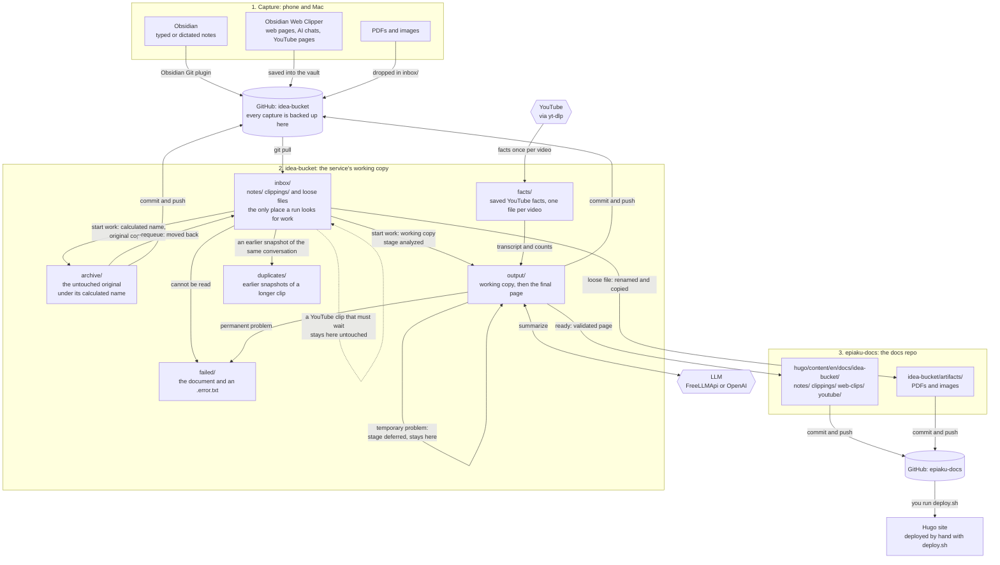
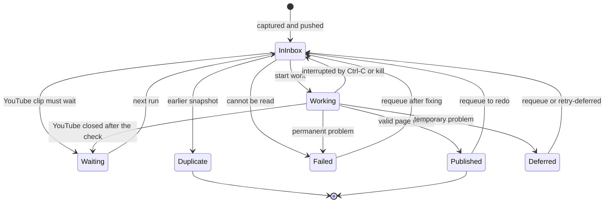

This page follows **one capture** from the moment you save it on your phone to the moment it is a page in the `epiaku-docs` repo. It shows the **folders** it moves through and what is written where. The processing inside one document (the parsing, the YouTube calls, the LLM) is on [the processing loop page](../idea-catcher-diagram-processing-loop/), and the software that does it is on [the architecture page](../idea-catcher-diagram-architecture/).

The inbox repo is called **`idea-bucket`**, and the docs repo **`epiaku-docs`**.

## The flow

## Step by step

1. **Capture.** You type or dictate a note in Obsidian, or clip a page, an AI chat or a YouTube page with the Web Clipper. The vault *is* the `idea-bucket` repo, and the **Obsidian Git** plugin pushes it to GitHub. From that moment the capture is **backed up**, even if it is never analysed.
2. **Pull.** The service pulls `idea-bucket`. New files appear in `inbox/`.
3. **Scan.** A run reads `inbox/` and nothing else. For each file it decides the **class** (a note, an AI chat, a web clip, a YouTube clip, or a Gemini chat about a video), gives it a stable id, and compares clips of the same conversation.
4. **Sort out.** A file that cannot be read goes to `failed/`. An earlier, shorter snapshot of the same conversation goes to `duplicates/` (nothing is deleted).
5. **Start work.** The document gets its **calculated name** (`YYYYMMDD-<short id>-<title>.md`). The original is copied to `archive/` (with two added frontmatter lines), a working copy is written to `output/` with `stage: analyzed`, and the file leaves `inbox/`. From now on it is in one place at a time.
6. **Analyse.** Python parses it, and for a YouTube clip fetches the facts (saved in `facts/`). The LLM summarizes it. All of that is on [the processing loop page](../idea-catcher-diagram-processing-loop/).
7. **Finish.** A valid page is written to `epiaku-docs` (named like the working copy, replacing an older page with the same id), and the same page becomes the final file in `output/`. A temporary problem leaves the working copy in `output/` with `stage: deferred` and the reason. A permanent problem moves it to `failed/`.
8. **Commit and push.** The run commits the files it touched in both repos, one commit per repo, and pushes only if asked (`--push`).
9. **Publish the site.** The pages are in the `epiaku-docs` repo, but the site changes only when you run `deploy.sh` yourself.

## The folders

| Folder | What is in it | Written by | How a file leaves |
| --- | --- | --- | --- |
| `inbox/notes/` | Typed or dictated notes | You, through Obsidian | When work starts on it |
| `inbox/clippings/` | Web pages, AI chats, YouTube pages (the Web Clipper) | You, through Obsidian | When work starts on it |
| `inbox/` (loose files) | PDFs and images | You | Renamed and copied as an artifact |
| `archive/` | The original, under its calculated name, plus two frontmatter lines (`original_filename`, `calculated_filename`) | The run, when work starts | `--requeue` moves it back to `inbox/`. A document that goes back (interrupted, or a clip that must wait) is moved back by the run itself |
| `output/` | The working copy (`stage: analyzed` or `deferred`), later the final page | The run | `--requeue` clears it |
| `failed/` | A document that could not be processed, with `<name>.error.txt` | The run | `--requeue` clears it |
| `duplicates/` | An earlier snapshot of a longer clip of the same conversation | The run | Moved back by hand |
| `facts/` | `<video id>.json`: the saved YouTube facts (counts, description, chapters, transcript) | The run, on the first fetch | Kept. `--refresh-facts` fetches again |

## A document's states

- **Waiting**: a YouTube clip that must wait for the gap between YouTube calls (or for a block to end) stays in `inbox/` untouched, and the next run takes it. If the gap closes after the clip was started (another run used it), or YouTube answers with a block, the run puts the clip **back** in `inbox/` under the same name, so it is waiting too.
- **Interrupted** (Ctrl-C or `kill`): the document being worked on goes back to `inbox/` under the same name, what was done is committed, and the run reports a problem. Nothing is lost and nothing is archived twice.
- **Deferred** means not done but not lost: the LLM or the budget was unavailable, or YouTube had no facts. The working copy says why. `--retry-deferred` puts all of them back in `inbox/` at once.
- A **requeue** moves the archived original back to `inbox/` and clears the stale copy in `output/` (and in `failed/`), then runs the document again.

## What changes in the file along the way

| Step | File | What is added |
| --- | --- | --- |
| Capture | `inbox/…/Start up brain.md` | Whatever the capture had: `source`, `created`, `tags`, and the text |
| Start work | `archive/…/20261001-a63131-start-up-brain.md` | Two lines: `original_filename` and `calculated_filename`. The text is unchanged |
| Start work | `output/…/20261001-a63131-start-up-brain.md` | `id`, `class`, `captured`, `source_file`, `analyzed_at` and `stage: analyzed` |
| Finish | the page in `epiaku-docs`, and the same file in `output/` | `title`, `description`, `date`, `weight`, `type: docs`, `id`, `tags`, `source_file`, `original_filename`, `language` (notes), `video_id` (YouTube), `warnings` (YouTube), and an `llm` block with the profile, backend, model and prompt version. `stage` is gone |

## Where a page ends up

| Class | How it is recognised | Folder in `epiaku-docs/hugo/content/en/docs/idea-bucket/` | LLM profile |
| --- | --- | --- | --- |
| `note` | No source link | `notes/` | `notes` (FreeLLMApi) |
| `ai-chat` | A Gemini or Claude chat link | `clippings/` | `clippings` (OpenAI) |
| `web-clip` | Any other web page link | `web-clips/` | `clippings` (OpenAI) |
| `youtube` | A YouTube link | `youtube/` | `youtube` (OpenAI) |
| `youtube-gemini` | A Gemini chat that holds a YouTube link | `youtube/` | `youtube` (OpenAI) |

A `type:` or `class:` line in the capture's frontmatter overrides the guess.

## What survives a disk crash

The captures are safe: they are on GitHub from the moment Obsidian pushes them. What can be lost is only what was produced since the last push: the archive copies, the working copies and pages, and the saved YouTube facts (so those videos would be fetched again). That is why the results should be committed and pushed at least once a day (see [YouTube IP bans and the queue](../idea-catcher-youtube-bans-and-queue-options/#when-to-commit)).
