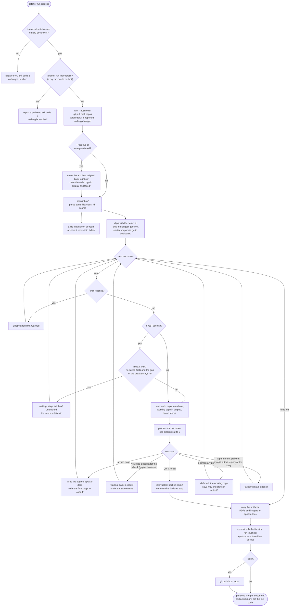
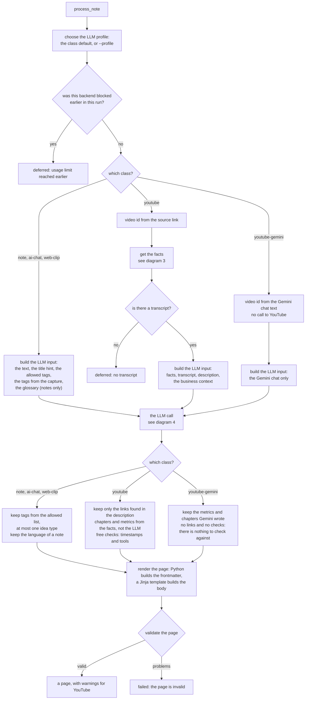
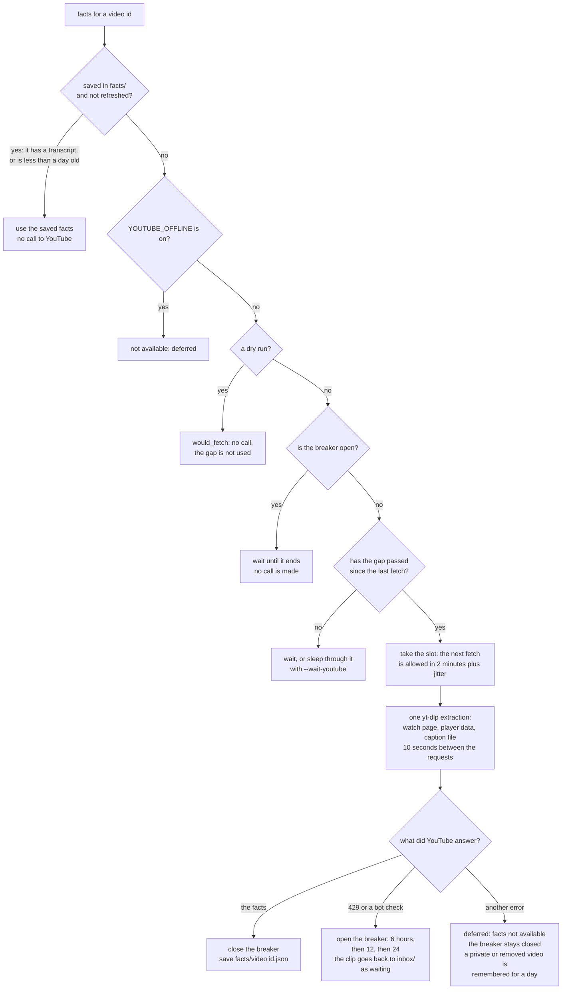
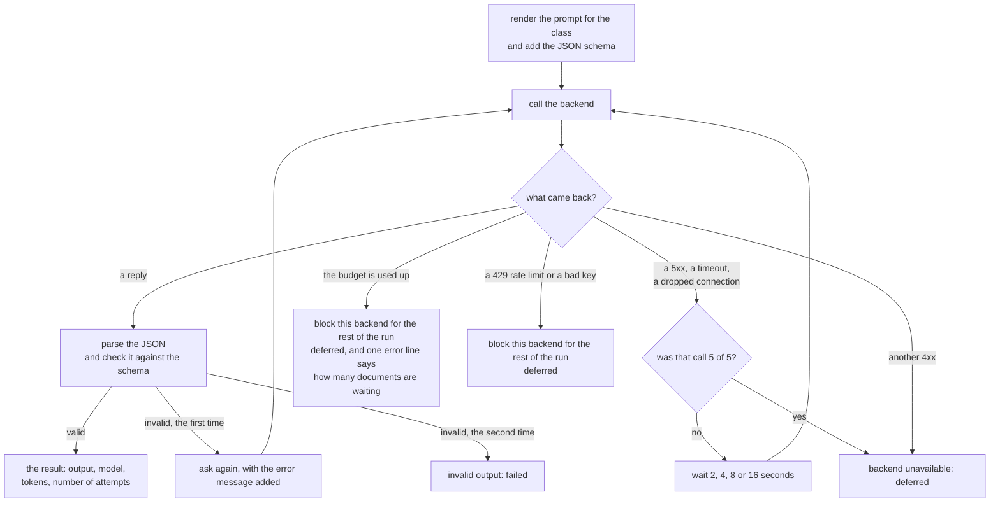
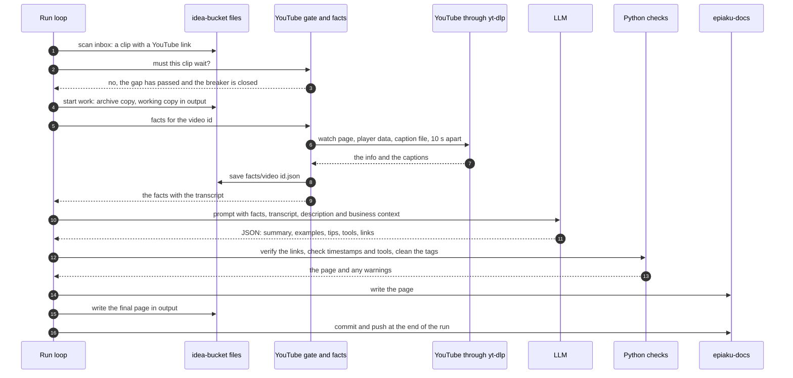

This page follows a document **through the program**: the loop that picks documents from the inbox, the steps Python does, the calls to YouTube and to the LLM, and every circuit breaker and limit on the way. Where the files end up is on [the document flow page](../idea-catcher-diagram-document-flow/), and what runs where is on [the architecture page](../idea-catcher-diagram-architecture/).

## 1. The loop over the inbox

This is `catcher run pipeline`, from start to the summary line.

- **One broken document never stops the run.** Every document is handled on its own, and an unexpected error becomes `failed` for that document only.
- **`--dry-run`** goes through the same steps, but writes no file and makes no commit. It still calls the LLM if the profile is a real one, unless a good reply is saved (it reads those, free), so use `--profile fake` for a free check. It **never calls YouTube** and does not use up the gap: a clip without saved facts shows `would_fetch`. A dry run takes no run lock.
- The commit is **one commit per repo at the end of the run**, with only the files the run touched.

## 2. One document: parse, analyse, summarize, check, write

`process_note` picks one path for the class. The three paths share the LLM call and the page steps.

**Who owns what.** The LLM returns only JSON (a summary, examples, tips, tools, tags, and for a note the language). **Python owns everything else**: the ids, the file names, the frontmatter, the metrics, the chapters, the tag list, the link check, the page layout and the validation. A number from YouTube is never written by the LLM.

## 3. The YouTube facts: saved facts, the gap, the breaker

Only a `youtube` clip does this. A `youtube-gemini` document never calls YouTube.

## 4. The LLM call: retries and limits

One call per document, with two kinds of retry and two kinds of stop.

## 5. The whole path of a YouTube clip

The same steps in time order, with everything that touches the document.

## What Python does to a document

| Step | Input | Output | Where in the code |
| --- | --- | --- | --- |
| Scan and parse | A markdown file in `inbox/` | A note in memory: frontmatter, text, source link | `inbox.py` (`scan_inbox`) |
| Detect the class | The `type` or `class` line, else the source link | `note`, `ai-chat`, `web-clip`, `youtube` or `youtube-gemini` | `doctypes.py` (`detect`) |
| Give a stable id | The class, the source link or a new id | A page id (a video id for YouTube) | `doctypes.py` |
| Compare clips | All clips with one id | The longest one goes on, the rest to `duplicates/` | `inbox.py` (`is_snapshot_of`) |
| Name it | The date, a short id, the title | `YYYYMMDD-<id>-<title>.md`, used in every folder | `inbox.py` |
| Start work | The note | The archive copy and the working copy | `inbox.py` (`start_work`) |
| Get the facts (YouTube) | The video id | Facts: counts, description, chapters, transcript | `youtube/access.py`, `gate.py`, `cache.py`, `facts.py` |
| Build the LLM input | The text, the facts, the tag lists, the glossary, the context | One dictionary for the prompt | `inputs.py` |
| Call the LLM | The prompt and the schema | A validated summary | `llm/service.py`, `llm/backends` |
| Check the summary (YouTube) | The summary and the facts | Verified links, warnings for a wrong timestamp or a tool that is not in the transcript | `youtube/checks.py` |
| Normalize the tags | The tags from the LLM and the capture | Tags on the allowed list, at most one idea type | `tags.py` |
| Render the page | The summary, the facts, the note | Frontmatter and body | `render.py` and `templates/` |
| Validate the page | The page | A list of problems, empty when it is fine | `validate.py` |
| Write | The page | The page in `epiaku-docs`, the final page in `output/` | `publish.py` |
| Commit | The touched files | One commit per repo | `core/git.py` |

## How a document ends

| What happened | Status | Where the file is | What you do |
| --- | --- | --- | --- |
| A valid page was written | `published` | A page in `epiaku-docs`, the final page in `output/`, the original in `archive/` | Nothing |
| A YouTube clip must wait for the gap or the breaker | `waiting` | Still in `inbox/`, untouched | Run again later |
| The gap closed after the check (another run used it), or YouTube answered with a block | `waiting` | Back in `inbox/` under the same name | Run again later |
| Ctrl-C or `kill` during a document | `interrupted` | Back in `inbox/` under the same name. What was done is committed. The run exits with code 2 | Run again |
| The LLM or its budget is unavailable, or YouTube gave no facts | `deferred` | `output/`, `stage: deferred` and the reason | `--retry-deferred` (all) or `--requeue NAME` (one) |
| The LLM output was invalid twice, the page is invalid, the document is empty or longer than `LLM_MAX_INPUT_CHARS`, or an unexpected error | `failed` | `failed/` with an `.error.txt` | Read the error, fix the cause, `--requeue` |
| A dry run found a YouTube clip without saved facts | `would_fetch` | Nothing was written, YouTube was not called | Run without `--dry-run` |
| A shorter clip of the same conversation | `duplicate` | `duplicates/` | Nothing |
| It was a dry run | `would_publish` | Nothing was written | Run without `--dry-run` |

## The circuit breakers and limits

| Protection | Where | What it does |
| --- | --- | --- |
| **The YouTube gap** | Before every fetch | At least 2 minutes (plus up to 5 minutes of jitter) between two fetches, so the calls are spread out. A clip that must wait stays in `inbox/`, or goes back there when the gap closed after its check |
| **The YouTube breaker** | After a 429 or a bot check | No call to YouTube for 6 hours, then 12, then 24. A fetch that works closes it. Retrying during a block would only make it longer |
| **Saved facts** | Before every fetch | A video is fetched once, ever. A retry, a requeue or a rerun reads `facts/<id>.json` |
| **The offline switch** | `YOUTUBE_OFFLINE=1` | Never call YouTube (development and tests) |
| **LLM retries** | Inside the backend | A 5xx, a timeout or a dropped connection is retried up to 5 calls, with 2, 4, 8 and 16 seconds between them. One more call if the JSON is invalid |
| **The usage-limit block** | During a run | A used-up budget, a 429 or a bad key blocks that backend for the rest of the run. The other documents that need it are deferred at once, without a call |
| **The run lock** | Start of a real run | Only one `catcher run pipeline` at a time on a machine (`pipeline.lock`). A second one is refused. A dry run needs no lock |
| **A damaged gate file** | The YouTube gate | The file is kept as `youtube-gate.corrupt` and the gate closes for the block hours, because losing an active block is the expensive mistake |
| **Empty or too long** | Before the LLM call | A document that is empty or longer than `LLM_MAX_INPUT_CHARS` fails without a call |
| **One broken document** | The loop | An unexpected error fails that one document only |
| **`--limit N`** | The loop | At most N documents are started. The rest stay in the inbox |
| **`--dry-run`** | The whole run | No file is written and nothing is committed |
